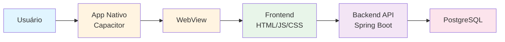
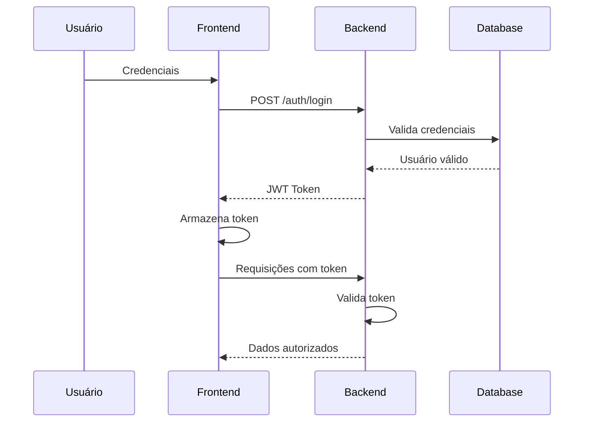

# Arquitetura do Sistema MUSA

## Visão Geral

O projeto MUSA segue uma arquitetura moderna de três camadas, projetada para ser escalável, manutenível e eficiente. A arquitetura web-centric garante que o código-fonte web seja a única fonte de verdade, facilitando manutenção e atualizações.


---

## Componentes do Sistema

### 1. Frontend (Cliente Web)

O frontend é uma **Single Page Application (SPA)** desenvolvida com tecnologias web puras, sem frameworks pesados.

#### Características

- **HTML5**: Estrutura semântica e acessível
- **CSS3**: Estilização moderna e responsiva
- **JavaScript ES6+**: Lógica de aplicação modular
- **Hospedagem**: Servidor estático
- **Roteamento**: Client-side routing para navegação fluida

#### Responsabilidades

- Renderização da interface do usuário
- Gerenciamento de estado da aplicação
- Validação de formulários client-side
- Comunicação com backend via REST API
- Experiência do usuário (UX)

---

### 2. Mobile (Capacitor)

O **Capacitor** atua como uma camada de abstração entre o código web e as plataformas nativas (iOS e Android).

#### Características

- **WebView Nativa**: Renderiza o aplicativo web dentro do app nativo
- **Plugins Nativos**: Acesso a recursos do dispositivo
- **Carregamento Remoto**: Carrega o frontend via URL hospedada
- **Atualizações Instantâneas**: Mudanças no web app refletem automaticamente no mobile

#### Recursos Nativos Disponíveis

- Notificações push
- Câmera e galeria
- Geolocalização
- Armazenamento local
- Compartilhamento
- Biometria

---

### 3. Backend (API REST)

O backend é implementado em **Java Spring Boot**, fornecendo uma API RESTful robusta e escalável.

#### Características

- **Spring Boot**: Framework enterprise-grade
- **PostgreSQL**: Banco de dados relacional
- **JWT**: Autenticação stateless
- **RESTful API**: Endpoints padronizados

#### Responsabilidades

- Autenticação e autorização
- Lógica de negócio
- Validação de dados server-side
- Persistência de dados
- Segurança e controle de acesso

---

## Fluxo de Dados



### Descrição do Fluxo

1. **Usuário** interage com o aplicativo nativo
2. **Capacitor** instancia uma WebView nativa
3. **WebView** carrega o frontend web da URL hospedada
4. **Frontend** faz requisições HTTP para o backend
5. **Backend** processa a lógica e acessa o banco de dados
6. **PostgreSQL** armazena e retorna dados persistidos

---

## Estrutura de Diretórios

```
musa/
│
├── css/                        # Folhas de estilo
│   └── style.css               # Estilos globais da aplicação
│
├── js/                         # Scripts JavaScript
│   ├── app.js                  # Orquestrador principal
│   ├── auth.js                 # Autenticação e sessão
│   └── router.js               # Sistema de roteamento SPA
│
├── pages/                      # Views/Templates HTML
│   ├── login.html              # Autenticação
│   ├── cadastro.html           # Registro de usuário
│   ├── home.html               # Dashboard principal
│   ├── eventos.html            # Listagem de eventos
│   ├── create.html             # Criação de eventos
│   ├── search.html             # Busca e filtros
│   └── user.html               # Perfil do usuário
│
├── assets/                     # Recursos estáticos
│   └── ArquiteturaDOCS.png     # Diagrama de arquitetura
│
├── .vscode/                    # Configurações do VS Code
│   └── settings.json           # Workspace settings
│
├── index.html                  # Ponto de entrada (SPA)
├── package.json                # Dependências npm
└── README.md                   # Documentação
```

---

## Padrões Arquiteturais

### Single Page Application (SPA)

O MUSA utiliza o padrão SPA para proporcionar uma experiência de usuário fluida e responsiva.

**Vantagens:**

- Navegação instantânea sem recarregamento de página
- Melhor experiência do usuário
- Redução de carga no servidor
- Facilita cache de recursos estáticos

**Implementação:**

- Roteamento client-side via `router.js`
- Carregamento dinâmico de páginas
- Gerenciamento de estado na aplicação

### Web-Centric Architecture

A arquitetura web-centric garante que o código web seja a fonte única de verdade.

**Benefícios:**

- **Manutenção Simplificada**: Uma única base de código
- **Atualizações Instantâneas**: Mudanças refletem em todas as plataformas
- **Consistência**: Mesma experiência em web e mobile
- **Redução de Custos**: Não é necessário manter código nativo separado

---

## Comunicação entre Componentes

### Frontend ↔ Backend

A comunicação entre frontend e backend ocorre via **REST API** usando JSON.

#### Exemplo de Requisição

```javascript
// Autenticação de usuário
fetch('https://api.musa.com/auth/login', {
  method: 'POST',
  headers: {
    'Content-Type': 'application/json'
  },
  body: JSON.stringify({
    email: 'usuario@example.com',
    password: 'senha123'
  })
})
.then(response => response.json())
.then(data => {
  // Armazena token JWT
  localStorage.setItem('token', data.token);
})
```

#### Autenticação JWT

Todas as requisições autenticadas incluem o token JWT no header:

```javascript
headers: {
  'Authorization': `Bearer ${token}`,
  'Content-Type': 'application/json'
}
```

---

## Segurança

### Camadas de Segurança

1. **HTTPS**: Todas as comunicações são criptografadas
2. **JWT**: Tokens stateless para autenticação
3. **CORS**: Controle de origem cruzada
4. **Validação**: Client-side e server-side
5. **SQL Injection**: Proteção via prepared statements
6. **XSS**: Sanitização de inputs

### Fluxo de Autenticação



---

## Escalabilidade

### Estratégias de Escalabilidade

#### Frontend

- **CDN**: Distribuição de conteúdo estático
- **Caching**: Cache agressivo de recursos
- **Lazy Loading**: Carregamento sob demanda
- **Minificação**: Redução de tamanho de arquivos

#### Backend

- **Load Balancing**: Distribuição de carga
- **Horizontal Scaling**: Múltiplas instâncias
- **Database Pooling**: Gerenciamento de conexões
- **Caching**: Redis para dados frequentes

---

## Tecnologias e Ferramentas

### Frontend
- HTML5, CSS3, JavaScript ES6+
- Fetch API para requisições HTTP
- LocalStorage para persistência client-side

### Mobile
- Capacitor 5+
- Plugins nativos oficiais

### Backend
- Java 17+
- Spring Boot 3.x
- Spring Security
- Spring Data JPA
- PostgreSQL 14+

### DevOps
- Git para controle de versão
- npm para gerenciamento de pacotes
- Prettier para formatação de código
- Live Server para desenvolvimento

---

## Próximos Passos

Para começar a desenvolver no projeto MUSA, consulte o [Guia de Início](comecando.md).

Para conhecer a equipe por trás do projeto, visite a [página da equipe](equipe.md).
